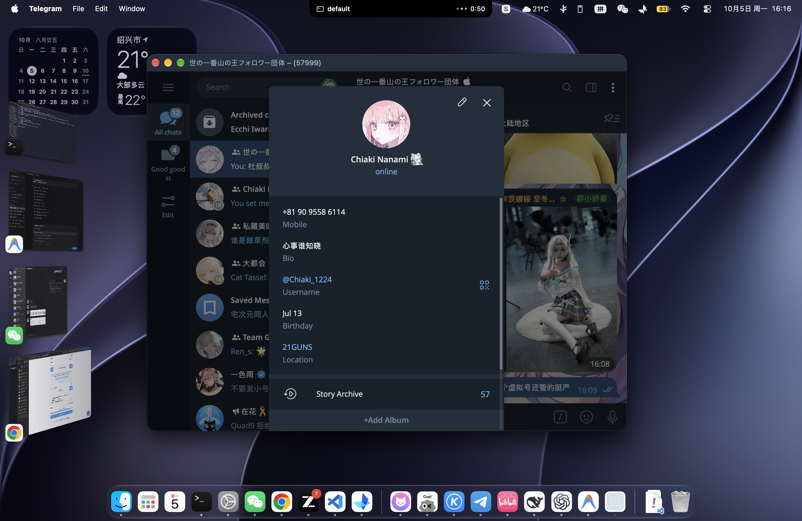

# TokenLedger

Every model call on this machine, in one ledger — tokens, plan credits and
API dollars — whatever GUI or CLI made it.



## What it does

ZCode, DeepSeek Harness, Codex, Claude Code each keep their own usage logs,
in their own formats, under their own directories. TokenLedger reads them
all, normalizes every record to one shape, and merges the same model's
spelling across tools (`GLM-5.3` in ZCode and `glm-5.3` in DSH are one
bucket, one burn curve), so a subscription's quota is measured as it is
spent: across every tool at once.

Three ledgers side by side, on every view:

- **Tokens** — fresh input, cache reads, cache writes, output, reasoning.
- **Plan credits** — the GLM Coding Plan formula (flash/standard tiers,
  peak window Mon–Fri 14:00–18:00 Asia/Shanghai at full price, off-peak at
  half), coefficients configurable.
- **Money** — API list price per model in CNY (`\u{a5} / 1M tokens`), with
  BigModel's published GLM prices built in; a model without a card shows
  tokens only, never a guess.

## Run it

```sh
cargo run                # the window (dev)
cargo run -- --smoke     # the whole ledger, printed to stdout
cargo run -- --dark      # start dark
cargo run -- --page 2    # start on a page: 0 overview, 1 models, 2 sessions, 3 sources
sh scripts/bundle.sh     # dist/TokenLedger.app — a real app: own icon slot,
open dist/TokenLedger.app  # own Dock presence, double-clickable, no terminal
```

No full Xcode needed; gpui compiles its Metal shaders at runtime.

## Data sources

Built-ins, discovered on launch, each toggleable on the Sources page:

| Source | Where it reads |
|---|---|
| ZCode | `~/.zcode/cli/db/db.sqlite`, table `model_usage` (per-request, billing-grade) |
| DeepSeek Harness | `~/.dsh/sessions/<workdir>/session-*/session.jsonl.zstd` |
| ChatGPT (Codex engine) | `~/.codex/sessions/**/*.jsonl` |
| Claude Code | `~/.claude/projects/**/*.jsonl` |

### Add any other tool

A source is a few lines in `~/.config/token-ledger/config.toml`. Point a
glob at any JSONL log, name the dotted field paths, and its calls join the
same ledgers as the built-ins:

```toml
[[source]]
id = "my-tool"
label = "My Tool"
kind = "jsonl"
paths = ["~/.mytool/sessions/*.jsonl"]
zstd = false
input_includes_cache = true   # true when the input number contains cache hits
model = "data.model"          # omitted fields are skipped per line
sticky_model = true           # reuse the last seen model (logs that state it once per turn)
time = "data.ts"
input = "data.usage.input"
output = "data.usage.output"
cache_read = "data.usage.cached"
cache_write = "data.usage.cache_write"
```

The same file carries the rest of the ledger:

```toml
[aliases]                     # spellings of one model, onto one key
kimi-k3 = "k3"

[credits]                     # plan formula, per 10k tokens
flash_in = 2.3
flash_cache = 0.56
flash_out = 8.0
std_in = 6.9
std_cache = 1.7
std_out = 24.0
divisor = 10000
offpeak_factor = 0.5

[prices."glm-5.3"]            # \u{a5} per 1M tokens; built-ins below, override freely
input = 8.0
cache_read = 2.0
output = 28.0
# currency = "usd"           # a USD card converts through fx_usd_cny
```

Built-in cards, every vendor's published list price (tiered or time-of-day
pricing takes its dear tier; DeepSeek's retired names bill as their
successor; OpenAI's page blocks machines, so its cards come from resellers
citing it — verify before invoicing anyone):

| Model | Input | Cache hit | Output | Currency |
|---|---|---|---|---|
| glm-5.3 | 8 | 2 | 28 | CNY |
| glm-5.3-flash | 0.8 | 0.23 | 2.8 | CNY |
| glm-5.3-flashx | 2 | 0.57 | 7 | CNY |
| glm-5.2 / glm-5.1 | 8 | 2 | 28 | CNY |
| glm-5 / glm-5-turbo | 6–7 | 1.5–1.8 | 22–26 | CNY |
| glm-4.7 | 4 | 0.8 | 16 | CNY |
| glm-4.7-flashx | 0.5 | 0.1 | 3 | CNY |
| glm-4.7-flash | free | free | free | CNY |
| kimi-k3 / k3 | 20 | 2 | 100 | CNY |
| kimi-k2.7-code | 6.5 | 1.3 | 27 | CNY |
| kimi-k2.7-code-highspeed | 13 | 2.6 | 54 | CNY |
| kimi-k2.6 | 6.5 | 1.1 | 27 | CNY |
| deepseek-v4-pro | 1.32 | 0.044 | 3.96 | USD |
| deepseek-v4-flash / deepseek-flash | 0.30 | 0.006 | 1.20 | USD |
| claude-opus-4.1 / 4 | 15 | 1.5 | 75 | USD |
| claude-sonnet-4 / 3.7 / 3.5 | 3 | 0.3 | 15 | USD |
| claude-haiku-3.5 | 0.8 | 0.08 | 4 | USD |
| claude-haiku-3 | 0.25 | 0.03 | 1.25 | USD |
| gpt-5.2 / gpt-5.2-codex | 1.75 | 0.175 | 14 | USD |
| gpt-5.5 | 5 | 0.5 | 30 | USD |

`fx_usd_cny = 7.2` (configurable) converts a `currency = "usd"` card into
the CNY ledger. `claude-fable` has no published official card and stays
unpriced rather than guessed.

An id that matches a built-in replaces it, so a built-in can be redirected
at a different path or turned off (`enabled = false`).

## Notes

- Same-id merging is spelling-only: `GLM-5.3`, `glm-5.3`,
  `bigmodel/glm-5.3` fold together; two different models never do. Unknown
  spellings get their own bucket until an alias maps them.
- ZCode's `input_tokens` is gross (cache reads inside); the ledger stores
  fresh input and cache reads separately for every source.
- A scan is a full re-read; press Rescan after heavy sessions. (Watching
  files live is on the way.)

Built with [Ely GPUI Components](https://github.com/ZacharyZhang-NY/Ely-GPUI-Components).
MIT or Apache-2.0, at your option.
